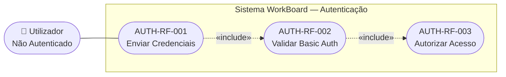
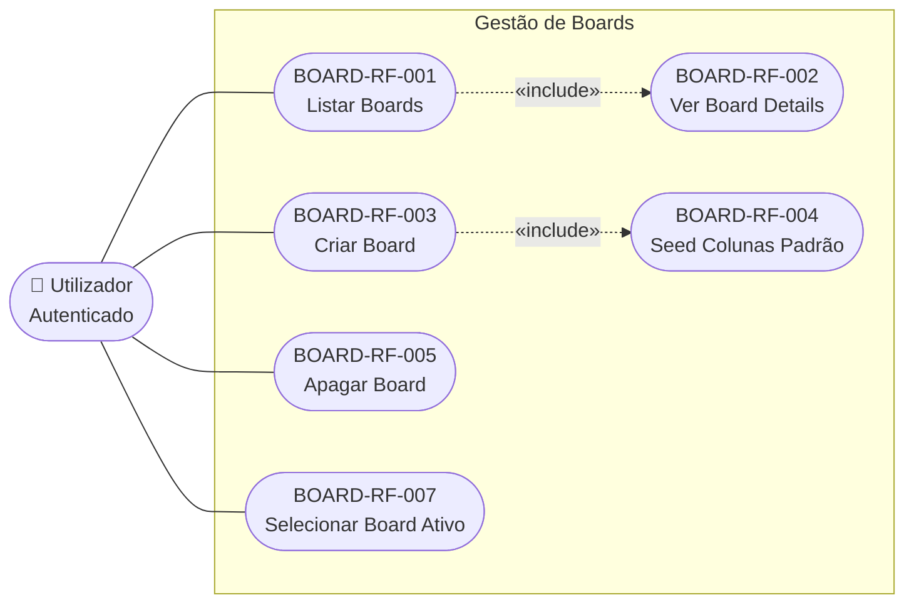
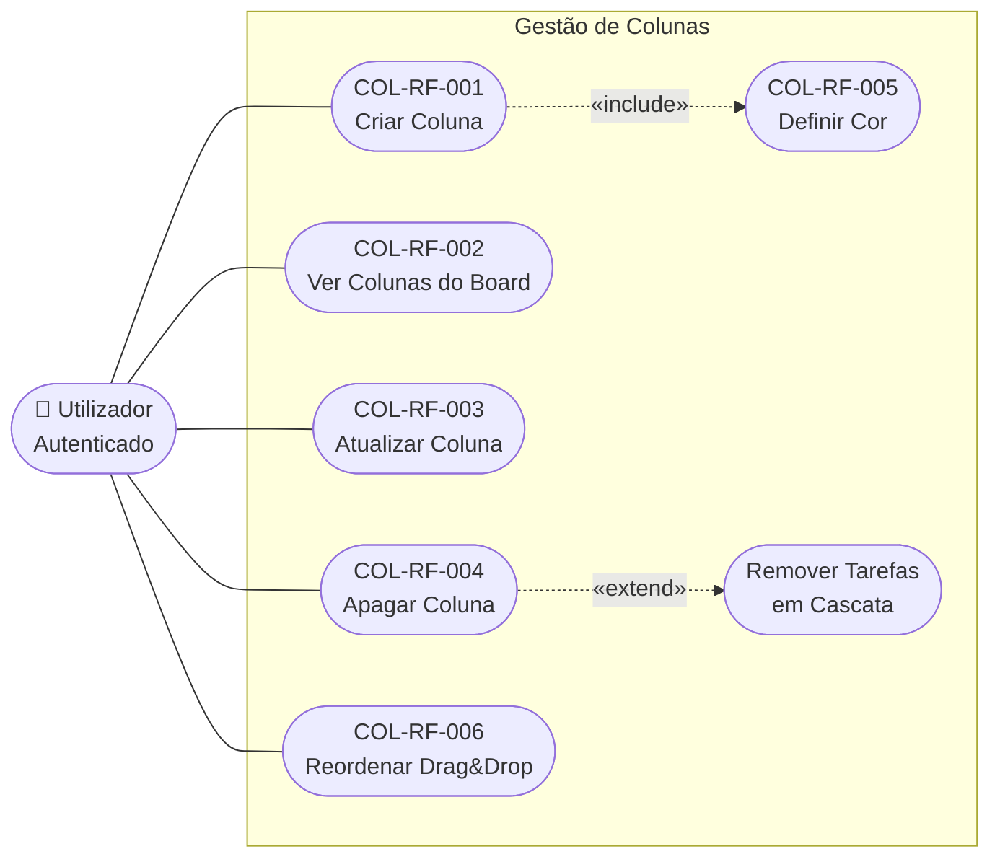
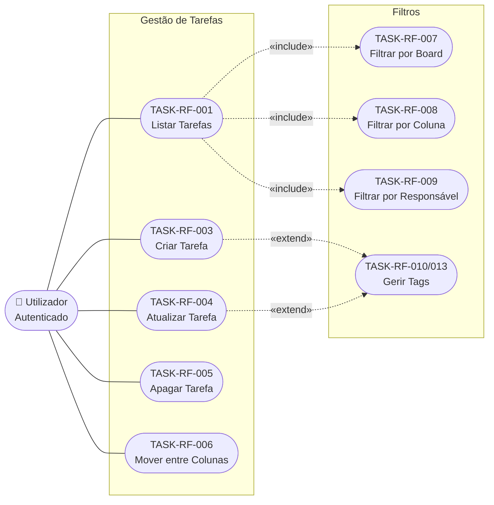
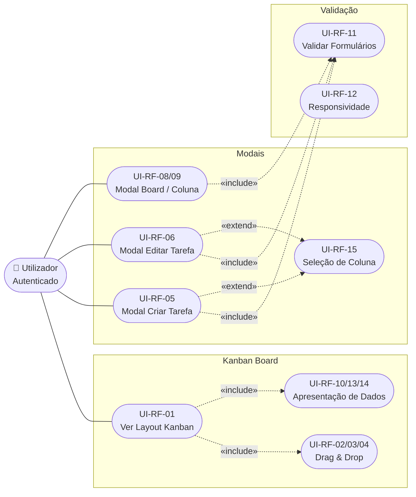
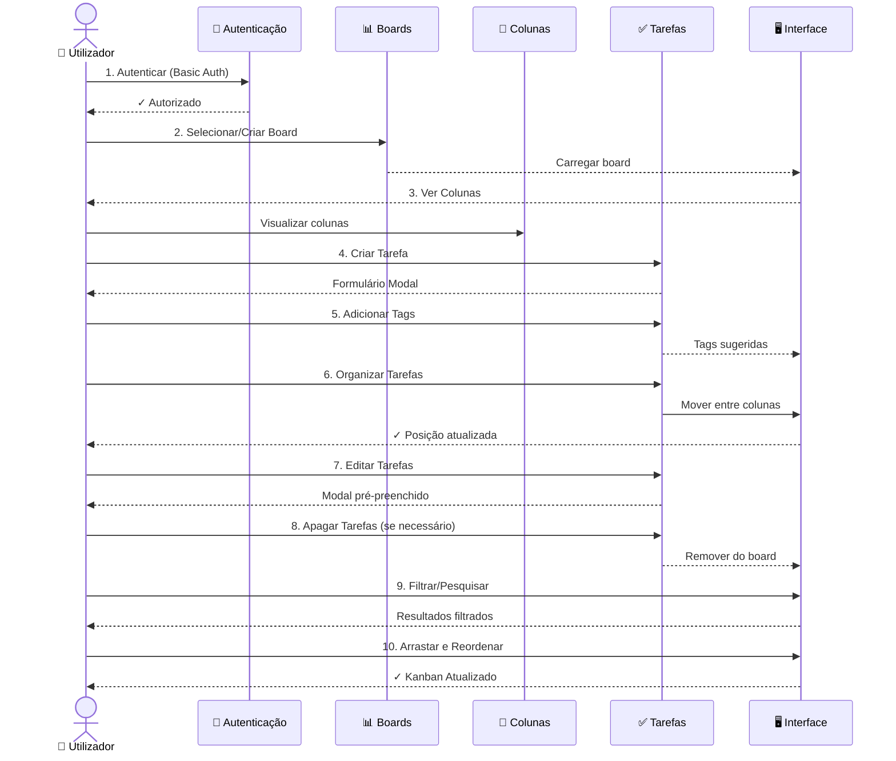

# Use Cases - WorkBoard

Diagramas de use cases em notação UML com atores, relações `<<include>>` e `<<extend>>`.

---

## 🔐 Autenticação (UC-AUTH)

**Associações:**
- `Utilizador` inicia **Enviar Credenciais**
- Enviar Credenciais `«include»` Validar Basic Auth — a validação é sempre executada
- Validar Basic Auth `«include»` Autorizar Acesso — acesso é concedido após validação

---

## 📊 Gestão de Boards (UC-BOARD)

**Notas:**
- Listar Boards `«include»` Ver Board Details — ao listar, é sempre carregado o detalhe do board selecionado
- Criar Board `«include»` Seed Colunas Padrão — criação de um board inclui sempre a criação das 3 colunas padrão
- **Restrição:** não é possível apagar o único board existente; o sistema mantém sempre ≥ 1 board

---

## 🎨 Gestão de Colunas (UC-COLUMN)

**Notas:**
- Criar Coluna `«include»` Definir Cor — toda a criação de coluna inclui a escolha de cor
- Apagar Coluna `«extend»` Remover Tarefas em Cascata — ao apagar uma coluna, todas as suas tarefas são removidas

---

## ✅ Gestão de Tarefas (UC-TASK)

**Notas:**
- Listar Tarefas `«include»` Filtrar por Board / Coluna / Responsável — os filtros são parte integrante da listagem
- Criar/Atualizar Tarefa `«extend»` Gerir Tags — a gestão de tags é opcional ao criar ou editar uma tarefa

---

## 🖥️ Interface do Utilizador (UC-UI)

**Notas:**
- Ver Layout Kanban `«include»` Drag & Drop e Apresentação de Dados — são sempre parte da visualização
- Todos os Modais `«include»` Validar Formulários — validação é sempre executada nos formulários
- Modal Criar/Editar Tarefa `«extend»` Seleção de Coluna — seleção de coluna é opcional/contextual

---

## 📋 Mapa de Requisitos para Use Cases

| Requisito | Use Case | Categoria |
|---|---|---|
| AUTH-RF-001 a 003 | UC-AUTH | Autenticação |
| BOARD-RF-001 a 007 | UC-BOARD | Gestão de Boards |
| COL-RF-001 a 006 | UC-COLUMN | Gestão de Colunas |
| TASK-RF-001 a 013 | UC-TASK | Gestão de Tarefas |
| UI-RF-01 a 15 | UC-UI | Interface do Utilizador |

---

**Última Atualização:** 30 de Maio de 2026  
**Versão:** v0.4.0

## 🔄 Fluxo Completo de Utilização (UC-FLOW)

**Segurança**: Basic Auth Middleware valida todas as requisições  
**Filtros**: Board | Coluna | Responsável | Tags (sugestões)  
**Sincronização**: Todas as operações sincronizadas com o backend em tempo real

---

## 📋 Mapa de Requisitos para Use Cases

| Requisito | Use Case | Categoria |
|---|---|---|
| RF-AUTH-01,02,03 | UC-AUTH | Autenticação |
| RF-BOARD-01 a 07 | UC-BOARD | Gestão de Boards |
| RF-COL-01 a 06 | UC-COLUMN | Gestão de Colunas |
| RF-TASK-01 a 13 | UC-TASK | Gestão de Tarefas |
| RF-UI-01 a 15 | UC-UI | Interface do Utilizador |

---

**Última Atualização**: 2 de Junho de 2026  
**Versão**: v1.0.0
